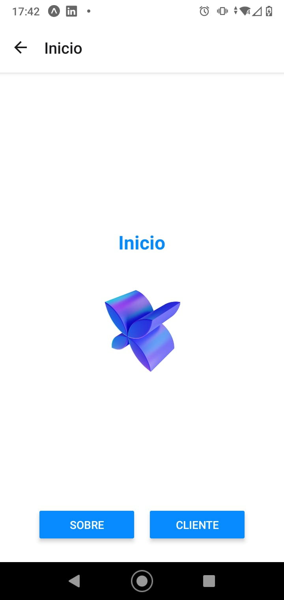
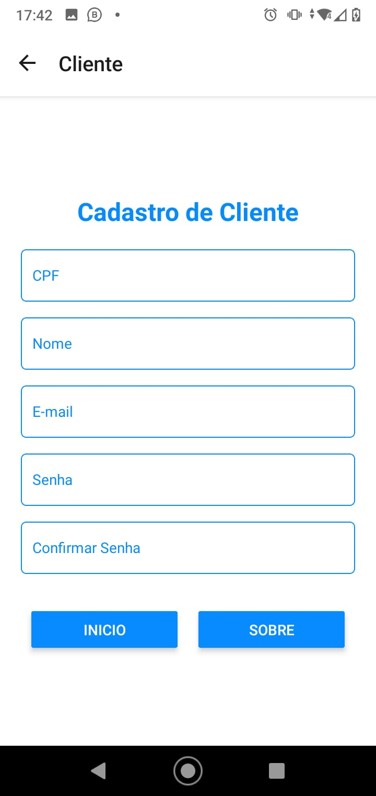

# Descrição do App

Este aplicativo oferece uma navegação simples entre três telas principais:

## Tela Inicial
Apresenta uma imagem e um botão que permite navegar para a tela "Sobre" ou "Cliente".

## Tela Cliente
Permite o cadastro de um novo cliente, solicitando dados como CPF, nome, e-mail, senha e confirmação de senha. Além disso, oferece navegação para as telas "Inicio" e "Sobre".

## Tela Sobre
Exibe informações sobre o aplicativo ou empresa.

O app foi projetado para ser fácil de usar, com uma interface limpa e funcional, e uma navegação fluída entre as telas.
